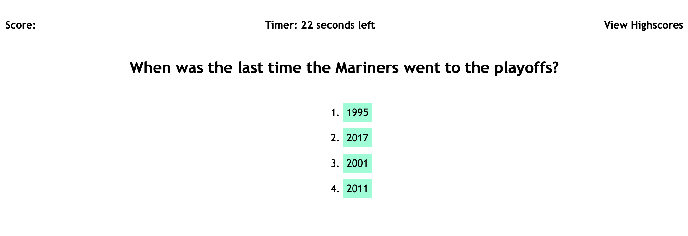
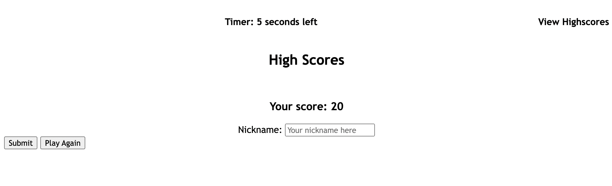
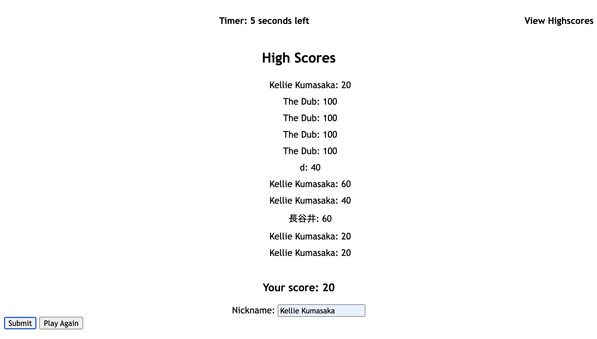

# code-quiz

This website is a working quiz with a timer that subtracts seconds when you get a question wrong, and adds points if you get a questions correct. Additionally, you can view the high scores when you click on high score at the top. 

## Deployment

You can play the game [here](https://kelliekumasaka.github.io/code-quiz/).

## Content

After pressing Start Game, you can click on the corresponding li for your guess. The program logs that and will take away 5 seconds from your time, or add 20 points to your score that appears when you get an answer correct.

Once the questions have been completed, you are taken to this form to get your name and then log that into local storage along with the score that you received.

After you submit, you are shown the highscores of the recent plays you have from your local storage. 

## Summary

While this game isn't the most beautiful, it is fairly functional and fulfills all of the requirements.